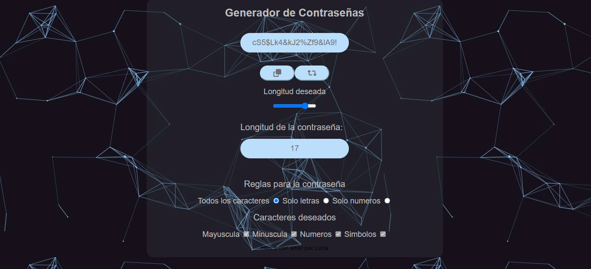

# Bienvenidos a mi generador de contraseñas! 🌸

Es un proyecto en el que llevo trabajando varios meses como instancia de evaluación en la academia AdaITW; En el mismo van a poder generar sus claves con un rango de longitud, y seleccionando su composicion que puede incluir letras, numeros y caracteres! 

**Van a descubrir**

- Codigo JavaScrip desarrollado desde cero por mi!
- Contiene: bucles, arrays, strings y mucha logica!
- Codigo HTML con radiobuttons y checkbox!!      
- Codigo CSS con estilos y algo de responsive!

**Tiene distintas funcionalidades**
- Generar una contraseña a través de una barra de rango de 06 a 20 caracteres!
- Copiar la contraseña con un boton!
- Tiene multiples opciones configuracion para hacer tu contraseña mas segura!

Esta es mi pagina para que la puedan visitar 💜 ! https://lumartinezz.github.io/generadorDeContrase-as/

*Espero que lo disfruten!* 😊

Pantallazo porfolio 
